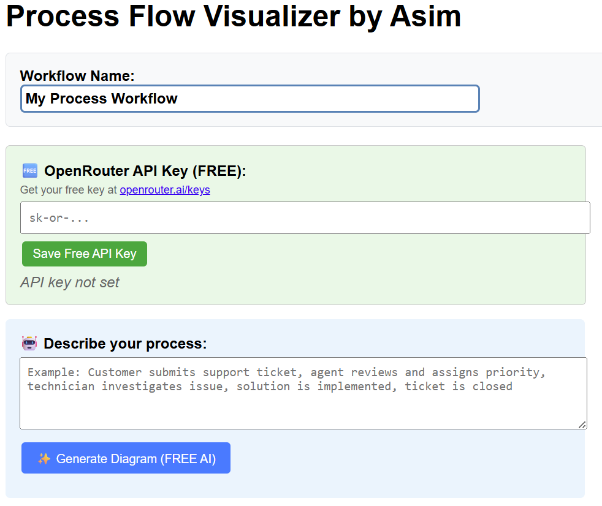
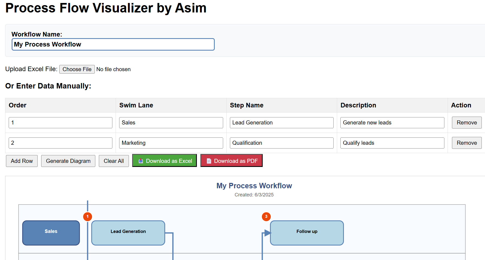

# 🧩 Process Flow Visualizer v5

**AI-Powered Interactive Process Flow Visualizer** with natural language generation, swim lane diagrams, Excel import/export, and PDF export. Built with D3.js, OpenRouter AI, and vanilla JavaScript.

## 🚀 **What's New in v5: AI Integration**

🤖 **Generate diagrams from natural language!** Simply describe your process in plain English:
- **FREE AI Integration** via OpenRouter API  
- **No complex setup** - works directly in your browser
- **Unlimited usage** with free models (Llama 4 Scout, Gemini)
- **Smart parsing** handles various AI response formats

---

🖼️ Screenshot

---

🖼️ Screenshot

---

A lightweight, interactive, browser-based tool for visualizing process workflows using swimlanes and process steps. This visualizer supports AI, manual data entry or Excel import, and allows exporting the diagram as both Excel and PDF.

---

## 🚀 **Features**

🤖 **AI-powered natural language generation** - Describe your process in plain English  
🖼️ **Swimlane-style process visualization** using D3.js  
📥 **Excel upload support** (XLSX and XLS)  
⌨️ **Manual data entry** through a dynamic table  
📤 **Export options** - Download process data as Excel or diagram as PDF  
🎨 **Dynamic rendering** with smart text wrapping and connectors  
🛠️ **Editable workflow name** and real-time updates  
🆓 **FREE unlimited AI usage** with OpenRouter free models  
📱 **Responsive design** - Works on desktop and mobile  
🔒 **No registration required** for basic features  

---

## 🛠️ **Tech Stack**

- **D3.js v7** - Interactive SVG visualization
- **OpenRouter API** - Free AI models (Llama 4 Scout, Gemini)
- **SheetJS (xlsx)** - Excel file processing
- **html2canvas** - High-quality PDF generation
- **jsPDF** - PDF creation and download
- **Vanilla JavaScript** - No frameworks, pure performance

---

## 📁 **File Structure**

- **`process-visualizer-v5.html`** - ⭐ **Latest with AI integration**
- **`process-visualizer-v4.html`** - Manual entry and Excel import only
- **`README.md`** - This documentation

---

## 🧪 **Usage**

### **🤖 Option 1: AI Generation (Recommended)**

1. **Get your free API key** from [OpenRouter](https://openrouter.ai/keys)
2. **Open the process-visualizer-v5.html tool** and enter your API key  
3. **Describe your process** in the text area:
For example: "Customer submits support ticket, agent reviews and assigns priority, technician investigates issue, solution is implemented, ticket is closed"
4. **Click "Generate Diagram"** and watch AI create your workflow!

### **📝 Option 2: Manual Data Entry**

1. Open `process-visualizer-v5.html` in any modern browser
2. Enter steps in the table: Order, Swim Lane, Step Name, Description
3. Click **Generate Diagram**

### **📊 Option 3: Excel Upload**

Prepare your Excel file with this format:

| Row | Content |
|-----|---------|
| **Row 1** | `Workflow Name:` followed by your title |
| **Row 2-3** | Skip these rows |
| **Row 4** | Headers: `Order`, `Swim Lane`, `Step Name`, `Description` |
| **Row 5+** | Your process steps |

Upload via **Upload Excel File** button - diagram generates automatically.

---

## 💡 **AI Prompt Examples**

Try these sample descriptions with the AI feature:
"Create an IT helpdesk customer support flow with ticket logging, assignment, resolution, and closure"
"Design a sales process from lead generation to contract signing"
"Map an employee onboarding workflow from application to first day"
"Create a quality control process for manufacturing with inspection points"
"Build a customer service escalation process with multiple tiers"

---

## 📤 **Exporting**

- **📄 Download as PDF** - High-resolution diagram with timestamp
- **📊 Download as Excel** - Process data with workflow name and date
- **🎨 Dynamic sizing** - Diagrams automatically adjust for content

---

## 🔧 **AI Setup (Free)**

1. **Sign up** at [openrouter.ai](https://openrouter.ai) (no credit card required)
2. **Generate API key** (starts with `sk-or-`)  
3. **Free models available**: Llama 4 Scout, Gemini 2.5 Pro, DeepSeek, and more
4. **Unlimited usage** on free tier models

---

## 📌 **Customization**

To modify styling or layout:
- **CSS styles** are embedded in the `<style>` section
- **Layout constants** are in the `ProcessVisualizer` class config
- **Spacing/sizing** can be adjusted in the `this.config` object

---

## 🆚 **Version Comparison**

| Feature             | v4 | v5 |
|---------            |----|----|
| Manual Entry        | ✅ | ✅ |
| Excel Import        | ✅ | ✅ |
| PDF/Excel Export    | ✅ | ✅ |
| **AI Generation**   | ❌ | ✅ **NEW!** |
| **Natural Language**| ❌ | ✅ **NEW!** |
| **Free AI Models**  | ❌ | ✅ **NEW!** |

---

## 🤝 **Contributing**

Feel free to:
- 🐛 **Report bugs** or suggest improvements
- 💡 **Request new AI models** or features  
- 🔧 **Submit pull requests** for enhancements
- ⭐ **Star the repo** if you find it useful!

---

## 🧑‍💻 **Author**

**Asim** - Creative solutions for visualizing complex workflows made simple.

- 🔗 **GitHub**: [github.com/asimkay](https://github.com/asimkay)
- 💼 **LinkedIn**: Connect for process improvement discussions

---

## 📄 **License**

MIT License. Free for personal and commercial use.

---

## 🔗 **Quick Links**

- **🚀 Live Demo**: [Try Process Visualizer v5](https://asimkay.github.io/process-visualizer/process-visualizer-v5.html)
- **🤖 Get Free AI Key**: [OpenRouter API Keys](https://openrouter.ai/keys)
- **📋 Report Issues**: [GitHub Issues](https://github.com/asimkay/process-visualizer/issues)
- **📖 Documentation**: [View on GitHub](https://github.com/asimkay/process-visualizer)

---

**🎯 Transform your process documentation with AI-powered visualization!**
